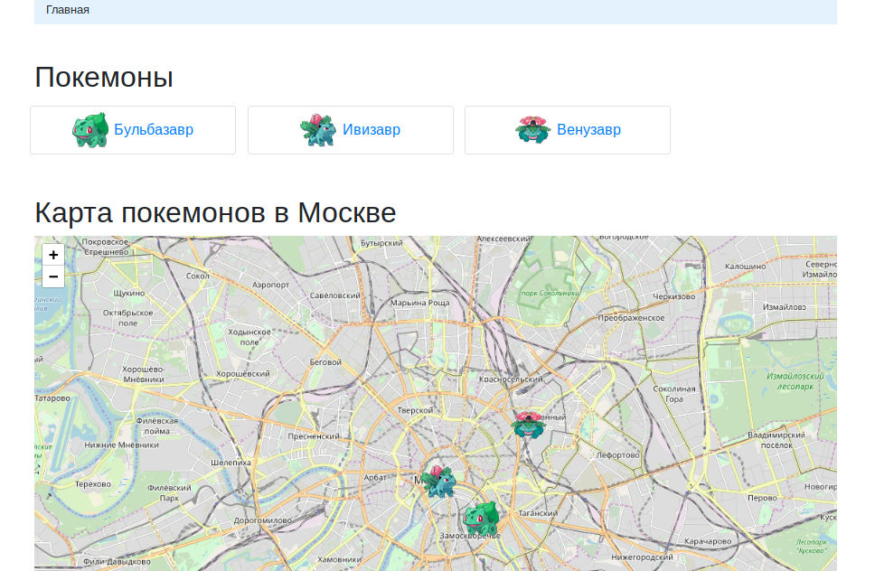
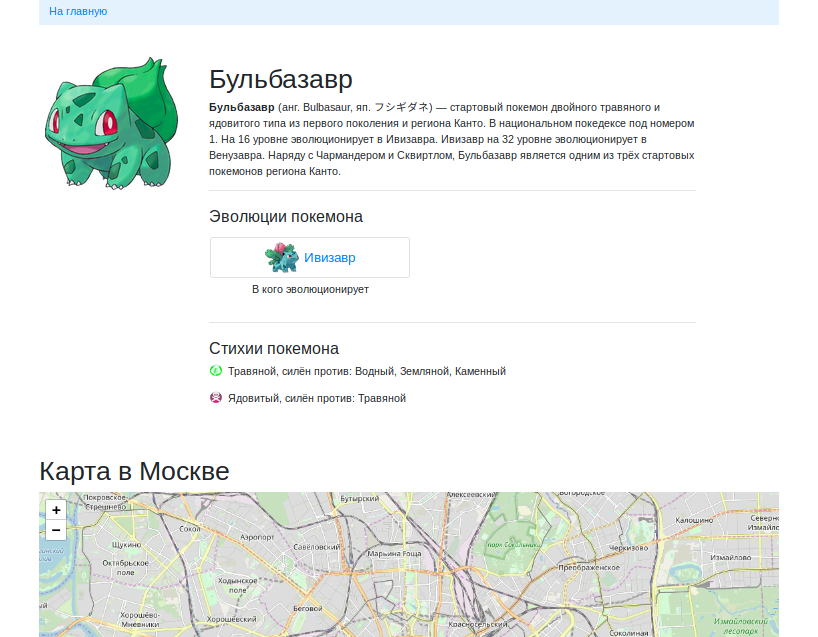

# Карта покемонов

### Предметная область

Сайт для помощи по игре [Pokemon GO](https://www.pokemongo.com/en-us/). Это игра про ловлю [покемонов](https://ru.wikipedia.org/wiki/%D0%9F%D0%BE%D0%BA%D0%B5%D0%BC%D0%BE%D0%BD).

Суть игры в том, что на карте периодически появляются покемоны, на определённый промежуток времени. Каждый игрок может поймать себе покемона, и пополнить свою личную коллекцию.

На карте может быть сразу несколько особей одного и того же покемона: например, 3 Бульбазавра. Каждую особь могут поймать сразу несколько игроков. Если игрок поймал себе особь покемона, она исчезает для него, но остаётся для других.

В игре есть механика эволюции. Покемон одного вида может "эволюционировать" в другого. Так, например, Бульбазавр превращается в Ивизавра, а тот превращается в Венузавра.

### Описание моделей

На сайте есть общие сведения о покемонах: модель `Pokemon`. Этот класс определяется через следующие поля:
- `title` — имя покемона, 
- `title_en` — имя (англ.),
- `title_jp` — имя (яп.),
- `description` — описание,
- `image` — картинка,
- `element_type` — типы стихии (связь с `PokemonElementType` через ManyToMany),
- `previous_evolution` — из кого эволюционировал (связь на самого себя через ForeignKey).

Также есть общие сведения о стихиях покемонов: модель `PokemonElementType`. Этот класс определяется через следующие поля:
- `title` — тип стихии, 
- `image` — картинка,
- `strong_against` — cилён против кого (связь на самого себя через ManyToMany).

У каждого покемона может быть несколько стихий, а каждая стихия может быть связана со многими покемонами. Модель `Pokemon` связана с моделью  `PokemonElementType` через поле `element_type` как многие ко многим. 

Модель `Pokemon` связана с моделью `PokemonEntity`, которая содержит в себе информацию о покемонах на карте. Класс `PokemonEntity` определяется через следующие поля:
- `pokemon` — общие сведения о покемоне (связь c `Pokemon` через ForeignKey)
- `latitude` — ширина, на которой находиться покемон
- `longitude` — долгота, на которой находиться покемон
- `appear_at` — дата и время, когда появится на карте
- `disappeared_at` — дата и время, когда пропадет с карты
- `level` — уровень
- `health` — здоровье
- `strength` — атака
- `defence` — защита
- `stamina` — выносливость

### Как запустить

- Скачайте код
- Установите зависимости командой `pip install -r requirements.txt`
- Запустите сервер командой `python3 manage.py runserver`

Доступ к сайту осуществляется по ссылке [http://localhost:8000](http://127.0.0.1:8000).

### Переменные окружения

Часть настроек проекта берётся из переменных окружения. Чтобы их определить, создайте файл `.env` рядом с `manage.py` и запишите туда данные в таком формате: `ПЕРЕМЕННАЯ=значение`.

Доступны 2 переменные:
- `DEBUG` — дебаг-режим. Поставьте True, чтобы увидеть отладочную информацию в случае ошибки.
- `SECRET_KEY` — секретный ключ проекта

### Пример функционирования сайта

В случае удачного запуска сайта главная страница будет выглядеть следующим образом.

Страница для выбранного покемона будет выглядеть так:

